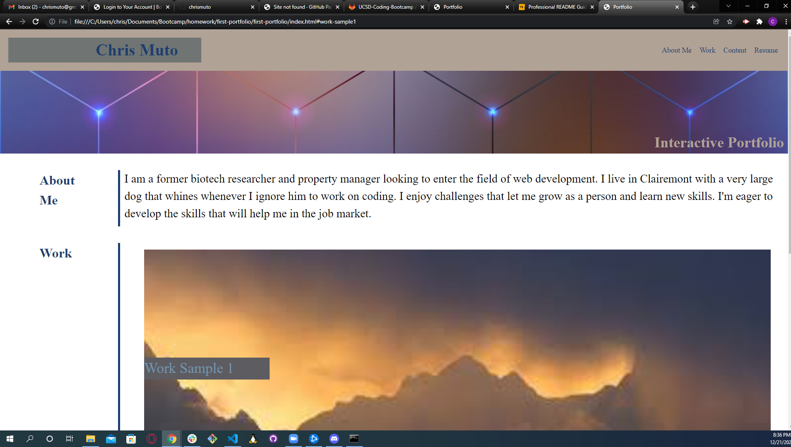

# first-portfolio

This project was designed as a template for a future portfolio showcasing projects I make during the coding bootcamp.

The portfolio template was a chance to apply a number of html and css techniques I had learned over the past week as well as creating a launching pad for future work that I can showcase to potential employers.

This project was a good chance to practice media queries and formatting for multiple display sizes. It also gave me an opportunity to practice proper html semantic formatting and webpage layout/design.

This project is well designed and showcases a variety of objectives met. The design was made in collaboration with a number of fellow students and combines the techniques we have learned to provide a full user experience.

Particularly difficult objectives in this project were the need for full scaling in multiple screen sizes. Avoiding absolute measurements and creating elements that could scale to any size forced me to adapt techniques from my classes to fit the goals I was given. This portfolio is something that I can update regularly in terms of both design and content in order to have a functional portfolio when I begin my job search.

Credit to David Luu, Jason Olsen, Marco Flores and Chris Vann for shared ideas during our study session

